# TryHackMe - Blue WriteUp

En este documento expondremos el recorrido realizado por la máquina Blue de TryHackMe, así como las soluciones propuestas.

## Índice

- [Recon](#recon)
- [Gain Access](#gain-access)
- [Escalate](#escalate)
- [Cracking](#cracking)
- [Flags](#flags)

## Recon

Escaneamos la máquina objetivo haciendo uso de nmap. Más concretamente, emplearemos el comando `nmap -sV -sC --script vuln IP`. Gracias a este, averiguaremos los puertos abiertos, los servicios en ejecución en dichos puertos, y sus versiones correspondientes. Además, obtendremos el nombre del host, que es **JON-PC**, y la vulnerabilidad que podremos emplear contra la máquina para acceder a la misma, siendo la **CVE-2017-0143**, que permite la ejecución remota de código en servidores con Microsoft SMBv1 (**ms17-010**).

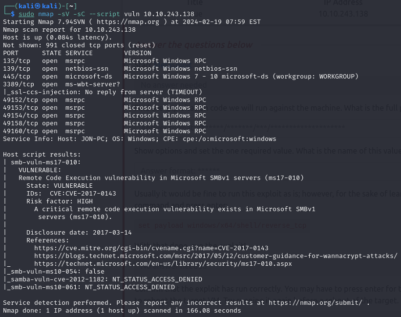

## Gain Access

Iniciamos Metasploit con el comando `msfconsole`, y una vez dentro, buscamos la forma de explotar la vulnerabilidad *ms17-010*. Para ello, empleamos el término `search`, seguido de la susodicha vulnerabilidad.

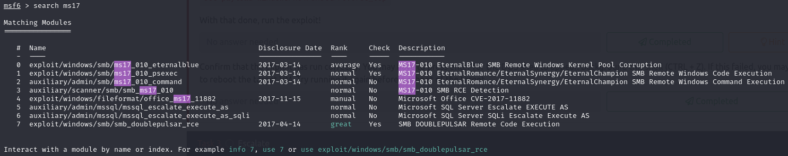

Vemos que la primera opción (*eternalblue*), es perfecta para tratar de acceder a la máquina, por lo que la seleccionamos, y mostramos las opciones del exploit.

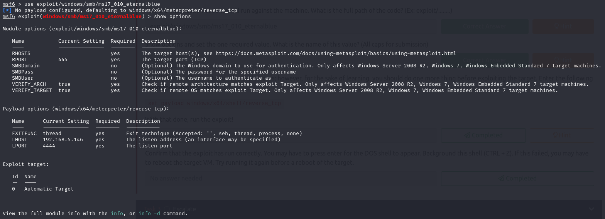

Cambiamos la opción *RHOSTS* a la IP de la máquina a vulnerar. Después de esto, podremos ejecutar el exploit, haciendp uso del comando `run` o `exploit`.

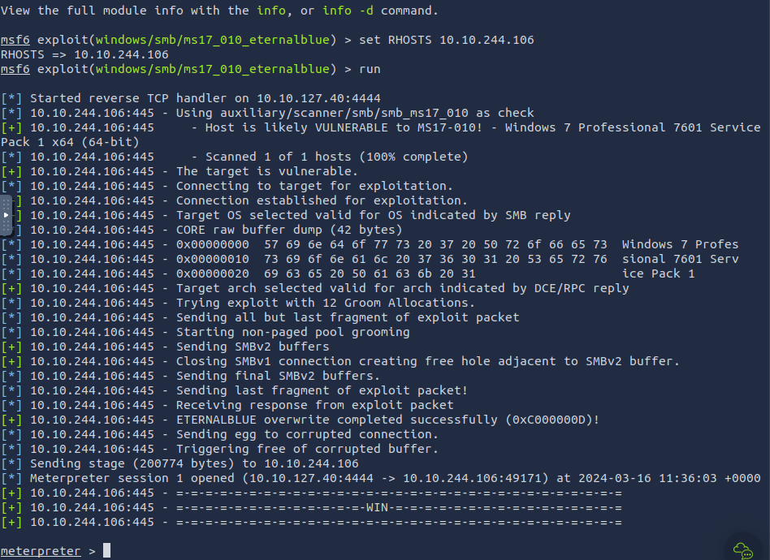

Una vez que vemos que ha funcionado, oprimimos **CTRL+Z** para dejar la sesión iniciada en segundo plano (*background*).

## Escalate

Convertimos nuestra shell en meterpreter, y para ello buscamos en Metasploit **shell_to_meterpreter*. Una vez que nos muestre los resultado, elegimos la primera (`use 0`).

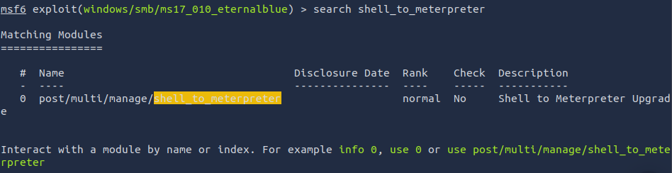

También debemos cambiar la opción **LHOST** a la IP de nuestra máquina.

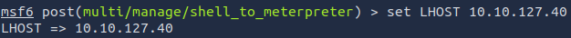

Podemos mostrar todas las sesiones activas con el comando `sessions -l`.

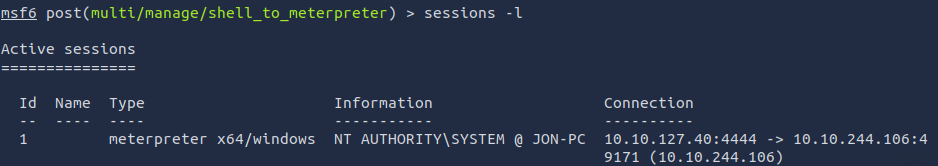

Ya configuradas todas las opciones pertinentes, lo ejecutamos, y cuando termine elegimos la última sesión, que será el producto de la conversión a meterpreter.

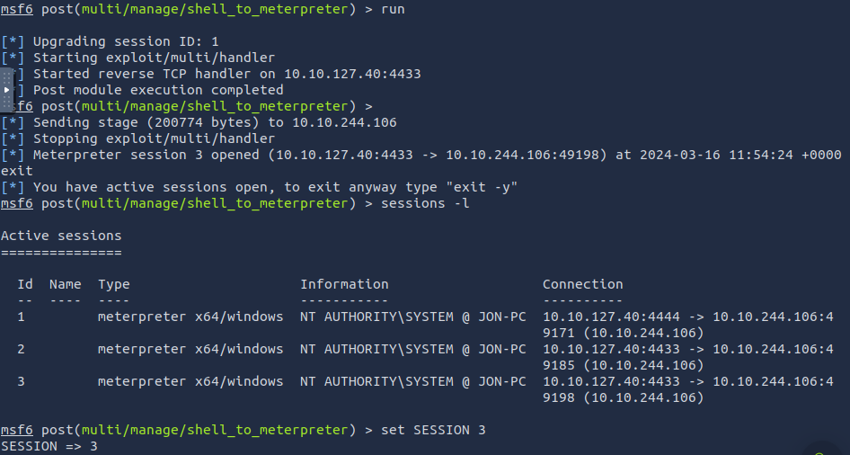

Si ejecutamos el comando `shell` seguid de `whoami`, la consola nos debería mostrar **NT AUTHORITY\SYSTEM**, lo que indica que hemos accedido y escalado privilegios de forma exitosa en el sistema.

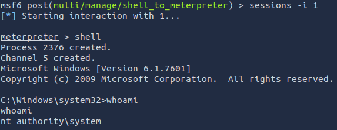

Ahora listaremos todos los procesos del sistema con el comando `ps`, para  migrar a un proceso corriendo bajo el usuario NT AUTHORITY\SYSTEM. Este proceso debería encontrarse en el fondo de la lista (en nuestro caso es el proceso ***conhost.exe***, con el PID ***2884***).

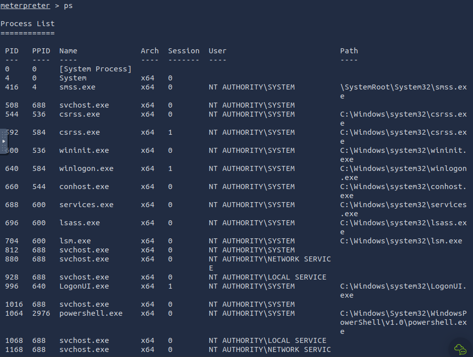

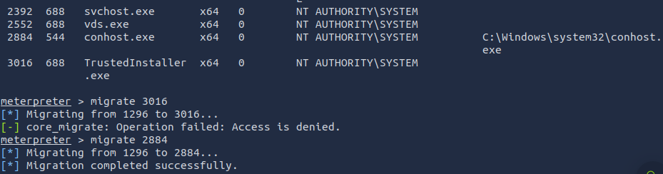

## Cracking

Comenzaremos ejecutando el comando `hashdump`, que mostrará los hashes de las contraseñas de los diferentes usuarios del sisgtema, entre ellos el usuario ***JON-PC***, que es el que nos interesa. 

Luego, anotaremos el hash de la contraseña del usuario antes mencionado en un archivo llamado hash.txt, de modo que usando el software *johntheripper*, podamos crackear el susodicho hash. 

Haremos uso de la librería rockyou ya incluida en el propio programa, y lo correremos contra el archivo hash.txt, lo que arrojará tras unos breves momentos la contraseña **alqfna22**.

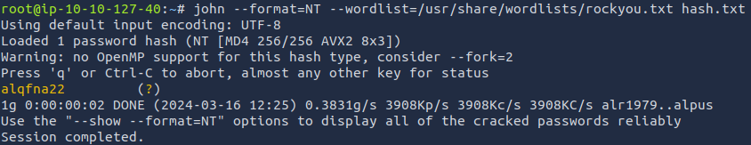

## Flags

La primera flag la encontraremos en el directorio **C:**, la cual tras usar `cat`, veremos la solución (*flag{access_the_machine}*). 

Para encontrar la segunda flag emplearemos el comando `search -f flag2.txt`, lo que nos arrojará como resultado la ubicación de la misma.

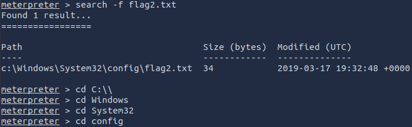

Luego accederemos a dicha ubicación y volveremos a usar `cat` para mostrar la flag.

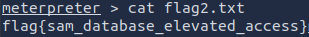

La tercera y última flag la encontramos en el directorio **Documents** del usuario *JON-PC*, por lo que accedemos a dicha carpeta y usamos `cat` de nuevo.

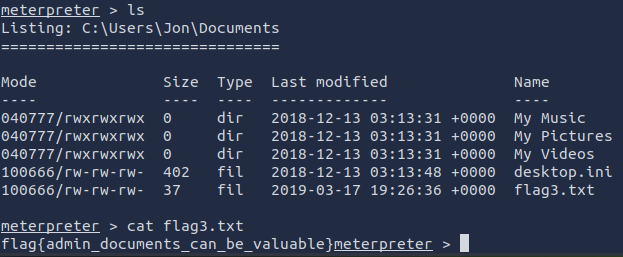